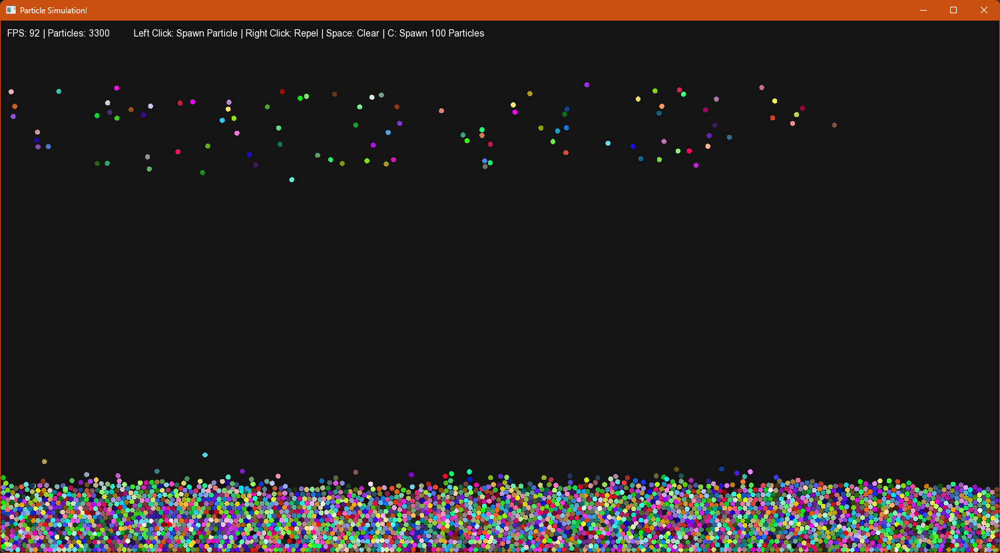

# SFML Particle Simulation

A real-time 2D particle physics simulation in C++ using SFML, featuring gravity, elastic collisions, a spatial hash grid for performance, and mouse interaction.



## Features

- Thousands of particles simulated in real-time
- Elastic collisions with restitution and damping
- Gravity and wall bouncing
- Spatial hash grid for fast broad-phase collision detection
- Batched vertex array rendering for high performance
- Mouse repulsion interaction
- Click to spawn particles, Space to clear

## Controls

| Input | Action |
|---|---|
| Left Click | Spawn a particle |
| Right Click (hold) | Repel nearby particles |
| Space | Clear all particles |

## Project Structure

```
Source Files/
    main.cpp        — window, game loop, events
    Particle.cpp    — particle physics, collision, rendering
    Utils.cpp       — math helpers (magnitude, distance, setMagnitude)

Header Files/
    Particle.h      — Particle struct declaration, simulation constants
    Utils.h         — math helper declarations
```

## Configuration

Constants at the top of `Particle.h`:

| Constant | Default | Description |
|---|---|---|
| `WIDTH` | 1500 | Window width in pixels |
| `HEIGHT` | 800 | Window height in pixels |
| `GRAVITY` | 500.0 | Downward acceleration |
| `PARTICLE_RADIUS` | 4.0 | Radius of each particle |
| `RESTITUTION` | 0.9 | Energy retained per collision (1.0 = perfectly elastic) |
| `DAMPING` | 0.999 | Per-frame velocity multiplier |

## Requirements

- C++17 or later
- [SFML 3.x](https://www.sfml-dev.org/)
- Visual Studio (or any C++ compiler with SFML linked)

## Building (Visual Studio)

1. Create a new Visual Studio C++ project
2. Install SFML and link the libraries (`sfml-graphics`, `sfml-window`, `sfml-system`)
3. Add all `.cpp` files to **Source Files** and `.h` files to **Header Files**
4. Build and run

## Performance

| Particles | FPS (approx) |
|---|---|
| 1000 | ~240 |
| 3000 | ~120 |
| 5000 | ~60 |

Performance depends on hardware. The spatial hash grid keeps collision detection near O(n) and batched vertex rendering minimizes GPU draw calls.
